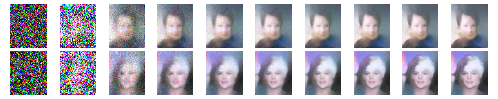

# Diffusion in Pytorch
A casual implementation of the image generative AI method diffusion. This code implements U-Net the is trained to predict noise in an image. At inference time, this can be used to predict and subsequently incrementally subtract the noise from an image of pure noise, slowly revealing the "signal" underneath. The result is a completely new signal, a new flower/face image.
- all in basic pytorch
- single and multi GPU training with pytorch's distributed data parallel DDP (TODO: use [lightening](https://lightning.ai/docs/pytorch/stable/))
- image generation
- this has not been finetuned or hyper parameter optimized, it is a quick and dirty implementation for teaching/learning.

# Setup
 - install [PyTorch](https://pytorch.org/) as appropriate for your system
 - install other modules `python -m pip install numpy matplotlib tensorboard pytest`
 - optionally run the (very basic) unit tests `pytest`

# Datasets
Currently, two datasets are setup, see `/dataset/README.md` for details on data download and preparation
- Oxford Flowers: 64 X 64 pixel images
- celebA: 109 X 89 pixel images

# Running
Once data is ready, `/scripts/` folder has all the entry points to train the model and generate images.
- `folders.py` contains model checkpoint and logging folder names for scripts to import
- `run_trainer.py` (RECOMENDED) trains the UNet on a single GPU
- `run_trainer_ddp.py` trains the UNet on multiple GPUS via DDP
- `run_generator.py` restores a model checkpoint, generates new images using CPU and saves as a png.

All experiments were run on PC with a Ryzen 9 5950X, 64GB RAM and 2 X Nvidia RTX 3090 GPUs, recognisable images can be generated even within ~ 1 hour of training.

Image generation only takes a few seconds, (yes even on CPU).

